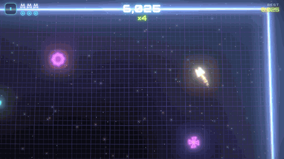
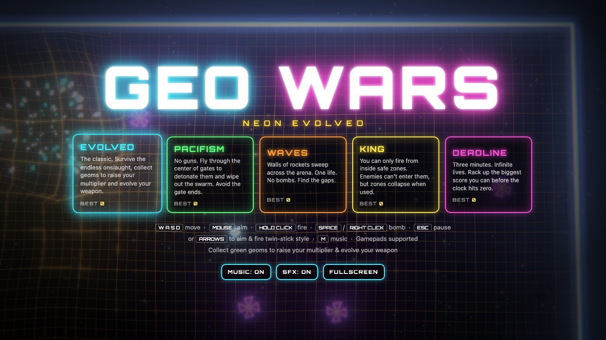
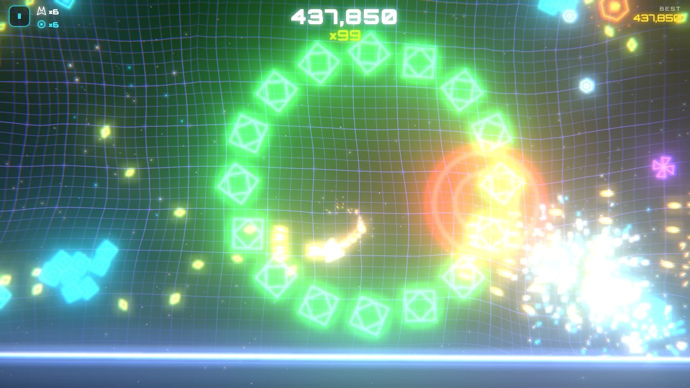
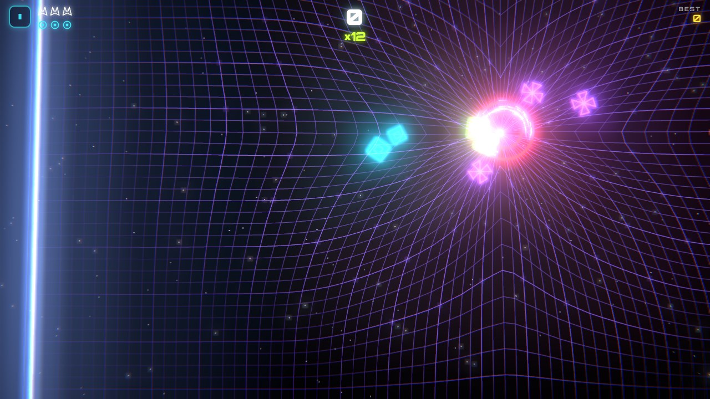
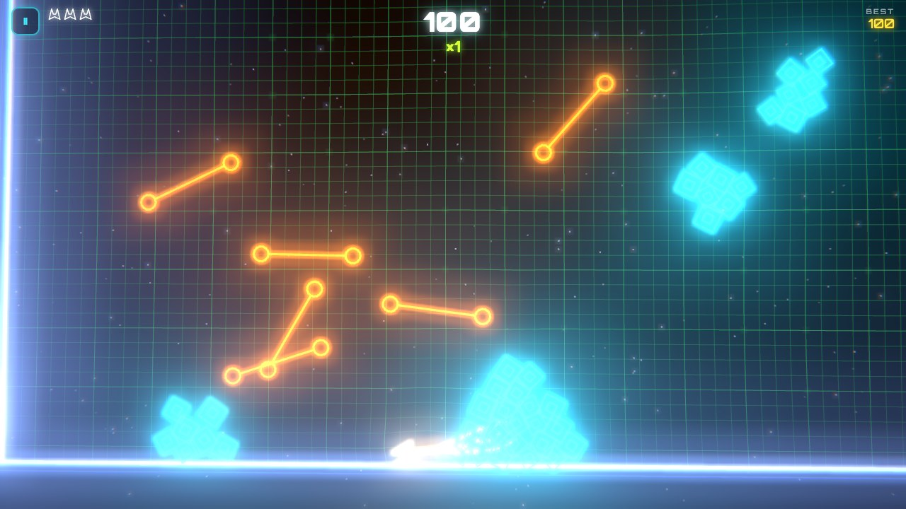
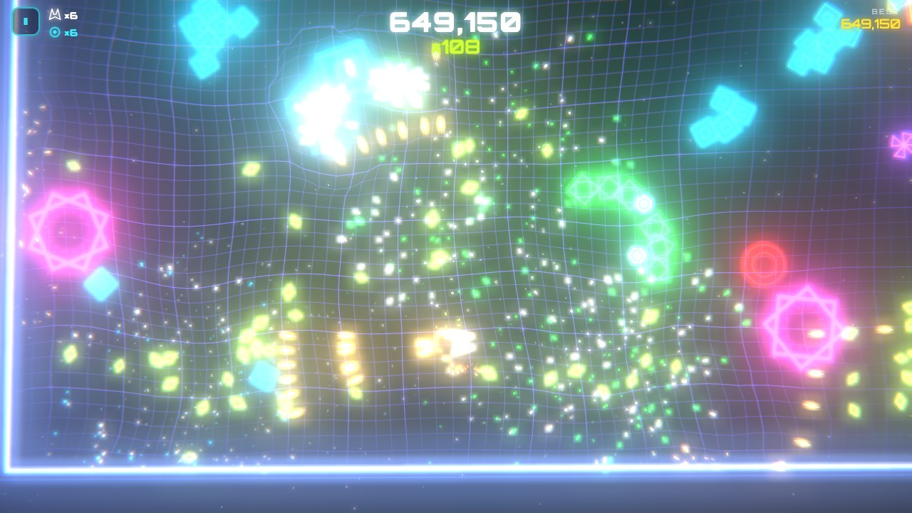
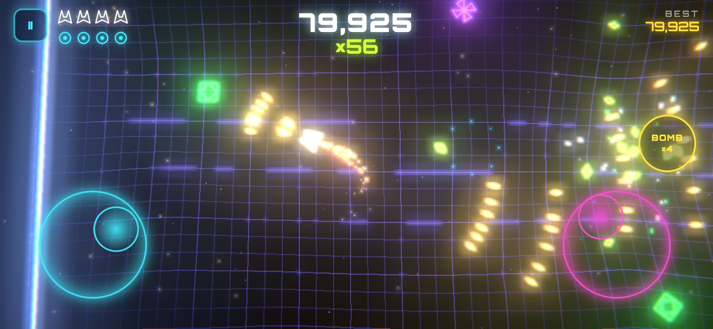

<div align="center">

# GEO WARS: NEON EVOLVED

**A Geometry Wars–inspired neon twin-stick shooter that runs in any browser.**<br>
Built with [Three.js](https://threejs.org/). One HTML file, no build step, playable on desktop, gamepad, and mobile.

### [▶ Play now: geowars-bice.vercel.app](https://geowars-bice.vercel.app)



</div>

---

## Screenshots

| | |
|:---:|:---:|
|  |  |
| **Five game modes** from across the series | **Evolved**: survive the endless onslaught |
|  |  |
| **Black holes** bend the grid, bullets, and you | **Pacifism**: no guns, just gates |
|  |  |
| **Geoms** pump your multiplier and evolve your weapon | **Mobile**: floating twin sticks and a bomb button |

## Quick start

### Play online

Open **https://geowars-bice.vercel.app** on any device. On phones, rotate to landscape for the best experience.

### Run locally

```bash
git clone https://github.com/nearbycoder/geowars.git
cd geowars
```

Then either **double-click `index.html`**, or serve the folder with any static server:

```bash
python3 -m http.server 8765
```

and open http://localhost:8765.

> Three.js and the Orbitron font load from public CDNs, so you need an internet connection on first load.

### Deploy your own

It's a static site, so any host works (GitHub Pages, Netlify, Cloudflare Pages, S3...). With Vercel:

```bash
npm i -g vercel
vercel --prod
```

[](https://vercel.com/new/clone?repository-url=https%3A%2F%2Fgithub.com%2Fnearbycoder%2Fgeowars)

## How to play

Move with one stick, aim and shoot with the other. Don't touch anything.

| | Move | Aim & fire | Bomb | Pause |
|---|---|---|---|---|
| **Keyboard + mouse** | `W` `A` `S` `D` | Mouse aims, hold left click to fire (or the arrow keys) | `Space` / right click | `Esc` / `P` |
| **Gamepad** | Left stick | Right stick | Bumpers / triggers | `Start` |
| **Touch** | Left thumb (anywhere on the left half) | Right thumb (anywhere on the right half) | `BOMB` button | `II` button |

`M` toggles music. Menus work with mouse, touch, keyboard arrows + `Enter`, or a gamepad D-pad + `A`.

### Scoring

- Destroyed enemies drop green **geoms**. Each one you collect adds **+1 to your multiplier**.
- Your weapon **evolves** as the multiplier climbs: twin stream → triple (×10) → quad (×25) → full spread (×50).
- Dying resets your multiplier and weapon, so stay alive.
- Score milestones award **extra lives and bombs**.
- **Bombs** send out a shockwave that clears every enemy on screen, but award no points.

### Game modes

| Mode | Rules |
|---|---|
| **Evolved** | The classic. Endless waves, 3 lives, 3 bombs. Difficulty ramps continuously. |
| **Pacifism** | No guns. Fly through the *middle* of orange gates to detonate them and wipe out nearby enemies. The gate ends are deadly. One life. |
| **Waves** | Walls of rockets sweep across the arena and bounce off the walls. One life, no bombs. Find the gaps. |
| **King** | You can only fire while standing inside a yellow safe zone. Enemies can't enter zones, but zones drain while you use them and collapse with a blast. |
| **Deadline** | Three minutes on the clock and infinite lives. Score as much as possible. |

### Enemies

| Enemy | Behaviour |
|---|---|
| 🟪 **Wanderer** | Drifts aimlessly. Easy points. |
| 🔷 **Grunt** | Chases you relentlessly. |
| 🟩 **Weaver** | Chases you and dodges your bullets. |
| 💗 **Spinner** | Splits into three orbiting minis when shot. |
| 🐍 **Snake** | Only the head is vulnerable. The tail kills on contact. |
| 🔴 **Black hole** | Activates when shot. It pulls in you, enemies, geoms, and bullets. It takes many hits, and if it swallows too much it bursts into fast seekers. |
| 🟠 **Rocket** | Flies straight and bounces off walls (Waves mode). |
| 🔹 **Dart / Proto** | Fast, erratic seekers. |

### Power-ups

Hexagonal pickups appear periodically in Evolved and Deadline:

| Pickup | Effect |
|---|---|
| **R**: Rapid fire | Nearly doubles fire rate |
| **S**: Super spread | 7-way spread shot |
| **P**: Piercing shot | Bullets pass through enemies |
| **W**: Bounce shot | Bullets ricochet off the walls |
| **O**: Shield | Invulnerable, and you destroy whatever you ram |
| **D**: Attack drone | An orbiting drone auto-targets enemies |
| **B / 1UP** | Extra bomb / extra life |

## Features

- **Warping spring-mass grid** that ripples from bullets and explosions and gets sucked into black holes
- **HDR bloom, chromatic aberration, screen shake, and slow motion** on big moments
- **Thousands of GPU particles** with streaks, wall bounces, and black-hole orbits
- **Procedural audio**: every sound effect and the adaptive synthwave soundtrack are generated live with the Web Audio API, and the music intensifies as the action heats up
- **Gamepad support** with rumble, plus vibration on supported phones
- **Mobile-first touch controls** with floating sticks, gentle aim assist, auto-fullscreen, and safe-area aware layout
- **Adaptive quality** that lowers resolution automatically if the frame rate drops
- **Per-mode high scores** saved in your browser
- Auto-pauses when you switch tabs

## Project structure

```
index.html   the entire game: markup, styles, and an ES module using Three.js via import map
docs/        README screenshots and gameplay GIF
```

Everything (rendering, physics, AI, audio synthesis, UI) lives in `index.html`, organized into clearly commented sections: renderer and post-FX, grid, particles, enemies, bullets, geoms, pickups, modes and spawning, input, HUD, and the main loop.

## Credits

A fan-made homage to Bizarre Creations' *Geometry Wars* series (Retro Evolved, Galaxies, Retro Evolved 2, and Dimensions). Not affiliated with or endorsed by Bizarre Creations or Activision. All code, visuals, and audio here are original.
